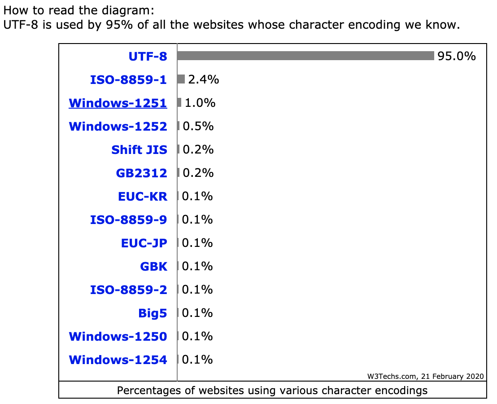

# 1

**Question:** Implement an algorithm to determine if a string has all unique characters. What if you cannot use additional data structures?

**Answer:** Ask interviewer what kind of string we are dealing with? Is it ASCII, extended ASCII or a Unicode string?

